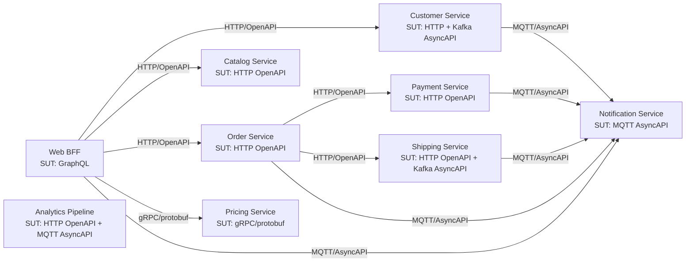

# Service Architecture Overview

This document is derived from the current `specmatic.yaml` files in each project. It reflects only declared system-under-test contracts and declared dependencies.

## Mermaid Diagram

## Service Table

| Service | SUT (spec + type + protocol) | Depends on (spec + type + protocol) |
|---|---|---|
| `web-bff` | `contracts/services/web-bff/graphql/schema.graphql` (GraphQL SDL, HTTP) | `contracts/services/customer-service/http/openapi.yaml` (OpenAPI, HTTP); `contracts/services/catalog-service/http/openapi.yaml` (OpenAPI, HTTP); `contracts/services/order-service/http/openapi.yaml` (OpenAPI, HTTP); `contracts/services/pricing-service/rpc/pricing.proto` (gRPC/protobuf, gRPC); `contracts/services/notification-service/events/asyncapi.yaml` (AsyncAPI, MQTT) |
| `customer-service` | `contracts/services/customer-service/http/openapi.yaml` (OpenAPI, HTTP); `contracts/services/customer-service/events/asyncapi.yaml` (AsyncAPI, Kafka) | `contracts/services/notification-service/events/asyncapi.yaml` (AsyncAPI, MQTT) |
| `catalog-service` | `contracts/services/catalog-service/http/openapi.yaml` (OpenAPI, HTTP) | none |
| `order-service` | `contracts/services/order-service/http/openapi.yaml` (OpenAPI, HTTP) | `contracts/services/payment-service/http/openapi.yaml` (OpenAPI, HTTP); `contracts/services/shipping-service/http/openapi.yaml` (OpenAPI, HTTP); `contracts/services/notification-service/events/asyncapi.yaml` (AsyncAPI, MQTT) |
| `payment-service` | `contracts/services/payment-service/http/openapi.yaml` (OpenAPI, HTTP) | `contracts/services/notification-service/events/asyncapi.yaml` (AsyncAPI, MQTT) |
| `shipping-service` | `contracts/services/shipping-service/http/openapi.yaml` (OpenAPI, HTTP); `contracts/services/shipping-service/events/asyncapi.yaml` (AsyncAPI, Kafka) | `contracts/services/notification-service/events/asyncapi.yaml` (AsyncAPI, MQTT) |
| `pricing-service` | `contracts/services/pricing-service/rpc/pricing.proto` (gRPC/protobuf, gRPC) | none |
| `notification-service` | `contracts/services/notification-service/events/asyncapi.yaml` (AsyncAPI, MQTT) | none |
| `analytics-pipeline` | `contracts/services/analytics-pipeline/http/openapi.yaml` (OpenAPI, HTTP); `contracts/services/notification-service/events/asyncapi.yaml` (AsyncAPI, MQTT) | none |
