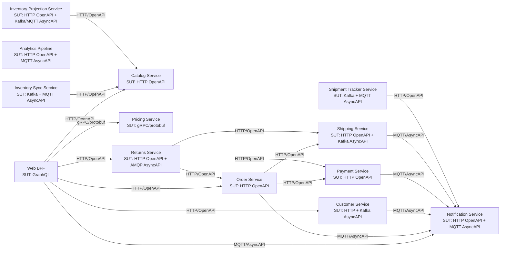

# Service Architecture Overview

This document reflects the current validated interactions across service implementations and contract wiring.

## Mermaid Diagram

## Bridge Services

- `inventory-sync-service`: Consumes inventory adjustment commands from Kafka (`inventory.adjustment.request`), publishes adjusted inventory state to MQTT (`inventory/adjusted`), and calls `catalog-service` over HTTP to keep inventory views aligned.
- `shipment-tracker-service`: Consumes shipment status change events from Kafka (`shipment.status.changed`), publishes realtime shipment status updates to MQTT (`shipment/status/realtime`), and calls `notification-service` over HTTP to trigger customer-facing notifications.

## Service Table

| Service | Description | SUT (spec + type + protocol) | Depends on (spec + type + protocol) |
|---|---|---|---|
| `web-bff` | GraphQL backend-for-frontend that composes customer, catalog, order, pricing, return, and notification capabilities for web clients. | <ul><li>`contracts/services/web-bff/graphql/schema.graphql` (GraphQL SDL, HTTP)</li></ul> | <ul><li>`contracts/services/customer-service/http/openapi.yaml` (OpenAPI, HTTP)</li><li>`contracts/services/catalog-service/http/openapi.yaml` (OpenAPI, HTTP)</li><li>`contracts/services/order-service/http/openapi.yaml` (OpenAPI, HTTP)</li><li>`contracts/services/returns-service/http/openapi.yaml` (OpenAPI, HTTP)</li><li>`contracts/services/pricing-service/rpc/pricing.proto` (gRPC/protobuf, gRPC)</li><li>`contracts/services/notification-service/events/asyncapi.yaml` (AsyncAPI, MQTT)</li></ul> |
| `customer-service` | Owns customer profile and preference lifecycle over HTTP and emits/responds to customer sync events over Kafka. | <ul><li>`contracts/services/customer-service/http/openapi.yaml` (OpenAPI, HTTP)</li><li>`contracts/services/customer-service/events/asyncapi.yaml` (AsyncAPI, Kafka)</li></ul> | <ul><li>`contracts/services/notification-service/events/asyncapi.yaml` (AsyncAPI, MQTT)</li></ul> |
| `catalog-service` | Provides product catalog, category, and availability read APIs for downstream consumers. | <ul><li>`contracts/services/catalog-service/http/openapi.yaml` (OpenAPI, HTTP)</li></ul> | <ul><li>none</li></ul> |
| `order-service` | Manages order placement and cancellation workflows and orchestrates payment, shipping, and notification integrations. | <ul><li>`contracts/services/order-service/http/openapi.yaml` (OpenAPI, HTTP)</li></ul> | <ul><li>`contracts/services/payment-service/http/openapi.yaml` (OpenAPI, HTTP)</li><li>`contracts/services/shipping-service/http/openapi.yaml` (OpenAPI, HTTP)</li><li>`contracts/services/notification-service/events/asyncapi.yaml` (AsyncAPI, MQTT)</li></ul> |
| `payment-service` | Handles payment authorization, capture, and refund operations for order flows. | <ul><li>`contracts/services/payment-service/http/openapi.yaml` (OpenAPI, HTTP)</li></ul> | <ul><li>`contracts/services/notification-service/events/asyncapi.yaml` (AsyncAPI, MQTT)</li></ul> |
| `shipping-service` | Manages shipment creation/cancellation over HTTP and participates in dispatch/fulfillment messaging over Kafka. | <ul><li>`contracts/services/shipping-service/http/openapi.yaml` (OpenAPI, HTTP)</li><li>`contracts/services/shipping-service/events/asyncapi.yaml` (AsyncAPI, Kafka)</li></ul> | <ul><li>`contracts/services/notification-service/events/asyncapi.yaml` (AsyncAPI, MQTT)</li></ul> |
| `pricing-service` | Serves price and discount calculations via gRPC contracts. | <ul><li>`contracts/services/pricing-service/rpc/pricing.proto` (gRPC/protobuf, gRPC)</li></ul> | <ul><li>none</li></ul> |
| `notification-service` | Accepts notification dispatch requests over HTTP and processes realtime notification traffic over MQTT. | <ul><li>`contracts/services/notification-service/http/openapi.yaml` (OpenAPI, HTTP)</li><li>`contracts/services/notification-service/events/asyncapi.yaml` (AsyncAPI, MQTT)</li></ul> | <ul><li>none</li></ul> |
| `analytics-pipeline` | Exposes analytics query APIs and consumes notification events for downstream reporting and analysis. | <ul><li>`contracts/services/analytics-pipeline/http/openapi.yaml` (OpenAPI, HTTP)</li><li>`contracts/services/notification-service/events/asyncapi.yaml` (AsyncAPI, MQTT)</li></ul> | <ul><li>none</li></ul> |
| `inventory-sync-service` | Bridge service that consumes inventory adjustment events from Kafka and republishes synchronized inventory updates over MQTT plus HTTP integration to catalog. | <ul><li>`contracts/services/inventory-sync-service/events/asyncapi.yaml` (AsyncAPI, Kafka + MQTT)</li></ul> | <ul><li>`contracts/services/catalog-service/http/openapi.yaml` (OpenAPI, HTTP)</li></ul> |
| `shipment-tracker-service` | Bridge service that consumes shipment status changes from Kafka and fan-outs realtime updates via MQTT and HTTP notification calls. | <ul><li>`contracts/services/shipment-tracker-service/events/asyncapi.yaml` (AsyncAPI, Kafka + MQTT)</li></ul> | <ul><li>`contracts/services/notification-service/http/openapi.yaml` (OpenAPI, HTTP)</li></ul> |
| `returns-service` | Handles return initiation and decision workflows over HTTP and publishes/consumes return lifecycle events over RabbitMQ (AMQP). | <ul><li>`contracts/services/returns-service/http/openapi.yaml` (OpenAPI, HTTP)</li><li>`contracts/services/returns-service/events/asyncapi.yaml` (AsyncAPI, AMQP/RabbitMQ)</li></ul> | <ul><li>`contracts/services/order-service/http/openapi.yaml` (OpenAPI, HTTP)</li><li>`contracts/services/payment-service/http/openapi.yaml` (OpenAPI, HTTP)</li><li>`contracts/services/shipping-service/http/openapi.yaml` (OpenAPI, HTTP)</li></ul> |
| `inventory-projection-service` | Maintains read-optimized inventory projections from event streams and exposes projection read APIs over HTTP. | <ul><li>`contracts/services/inventory-projection-service/http/openapi.yaml` (OpenAPI, HTTP)</li><li>`contracts/services/inventory-projection-service/events/asyncapi.yaml` (AsyncAPI, Kafka + MQTT)</li></ul> | <ul><li>`contracts/services/catalog-service/http/openapi.yaml` (OpenAPI, HTTP)</li></ul> |
