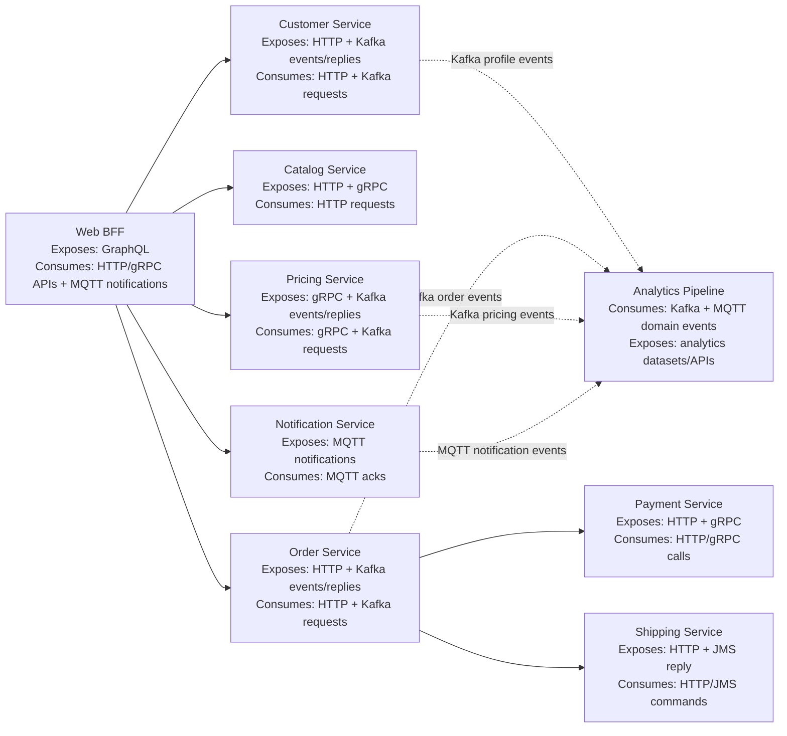

# Service Architecture Overview

This document describes a hypothetical internal microservice landscape with mixed protocols and contract types.

## Mermaid Diagram

## Service Descriptions

### Web BFF
- Purpose: Client-facing aggregation layer for web UI journeys.
- Depends on: [Customer Service](#customer-service), [Catalog Service](#catalog-service), [Order Service](#order-service), [Pricing Service](#pricing-service), [Notification Service](#notification-service).
- Exposes: GraphQL API to frontend clients.
- Consumes: HTTP/OpenAPI APIs from Customer, Catalog, and Order; gRPC APIs from Pricing; AsyncAPI/MQTT notification streams from Notification Service.
- Protocols:
  - Inbound: GraphQL over HTTP
  - Outbound: HTTP, gRPC, MQTT

### Customer Service
- Purpose: Owns customer profiles, preferences, and account state.
- Depends on: Internal customer datastore (no upstream service in this list).
- Exposes: REST endpoints (`customer-service/http/openapi.yaml`), Kafka domain events (`customer.profile.updated`), and Kafka reply messages for preference sync (`customer.preference.sync.reply`).
- Consumes: HTTP requests from [Web BFF](#web-bff), Kafka request messages for preference sync (`customer.preference.sync.request`).
- Protocols:
  - Inbound: HTTP/REST, Kafka
  - Outbound: HTTP responses, Kafka events and Kafka request/reply responses

### Catalog Service
- Purpose: Owns product catalog and availability-facing product views.
- Depends on: Internal catalog/index stores (no upstream service in this list).
- Exposes: REST APIs and internal gRPC APIs for low-latency reads.
- Consumes: Requests from [Web BFF](#web-bff).
- Protocols:
  - Inbound: HTTP/REST, gRPC
  - Outbound: Synchronous responses

### Order Service
- Purpose: Owns order lifecycle (create, update, status transitions).
- Depends on: [Payment Service](#payment-service), [Shipping Service](#shipping-service).
- Exposes: REST APIs (`order-service/http/openapi.yaml`), Kafka order events (`order.created`, `order.status.changed`), and Kafka validation replies (`order.validation.reply`).
- Consumes: HTTP commands from [Web BFF](#web-bff) and Kafka validation requests (`order.validation.request`).
- Protocols:
  - Inbound: HTTP/REST, Kafka
  - Outbound: HTTP/gRPC to Payment, HTTP to Shipping, Kafka events/request-reply

### Payment Service
- Purpose: Handles payment authorization, capture, and refund flows.
- Depends on: Internal payment processors/adapters.
- Exposes: REST + gRPC payment operations.
- Consumes: Payment calls from [Order Service](#order-service).
- Protocols:
  - Inbound: HTTP/REST, gRPC
  - Outbound: Synchronous responses

### Shipping Service
- Purpose: Manages shipment creation, dispatch, and tracking lifecycle.
- Depends on: Internal/legacy fulfillment integrations.
- Exposes: REST shipment APIs (`shipping-service/http/openapi.yaml`) and JMS fulfillment replies (`queue.order.fulfillment.reply`).
- Consumes: Shipment requests from [Order Service](#order-service) via HTTP and JMS dispatch commands from legacy integrations.
- Protocols:
  - Inbound: HTTP/REST, JMS
  - Outbound: HTTP responses, JMS request/reply responses

### Pricing Service
- Purpose: Computes prices, discounts, and pricing context.
- Depends on: Internal pricing rules/data sources.
- Exposes: gRPC pricing API (`pricing-service/rpc/pricing.proto`), Kafka price-change events (`pricing.price.changed`), and Kafka quote replies (`pricing.quote.reply`).
- Consumes: Price lookup calls from [Web BFF](#web-bff) and Kafka quote requests (`pricing.quote.request`).
- Protocols:
  - Inbound: gRPC, Kafka
  - Outbound: gRPC responses, Kafka events and Kafka request/reply responses

### Notification Service
- Purpose: Orchestrates user notifications across channels/devices.
- Depends on: Internal template/channel providers.
- Exposes: MQTT user notification topic (`notification/user`).
- Consumes: MQTT delivery acknowledgements (`notification/ack`) from clients/devices.
- Protocols:
  - Inbound: MQTT
  - Outbound: MQTT notifications

### Analytics Pipeline
- Purpose: Builds analytical datasets from cross-service event streams.
- Depends on: Event producers ([Customer Service](#customer-service), [Order Service](#order-service), [Pricing Service](#pricing-service), [Notification Service](#notification-service)).
- Exposes: Curated analytics outputs (dashboards/datasets/APIs).
- Consumes: Domain event streams (not request/reply channels) from producer services over Kafka and MQTT.
- Protocols:
  - Inbound: Kafka and MQTT (event streams)
  - Outbound: Platform-specific analytics interfaces
